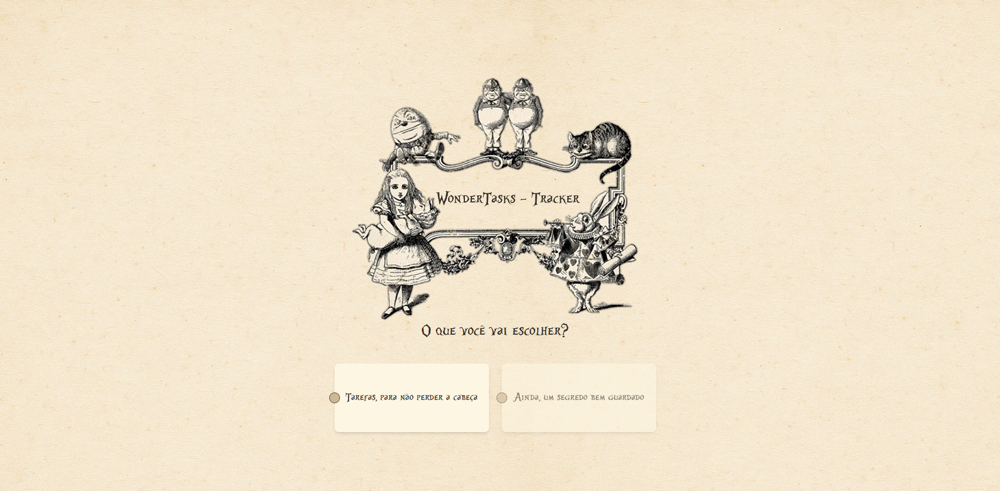

# Wonder Tasks Tracker

## About

This is a simple task tracker app that allows you to create and delete tasks.

<p align="center">
  
</p>

## Project setup

Prerequisites

- Node.js 16+

Installation

```sh
git clone https://github.com/mariana-morais/wondertasks-tracker.git
cd wondertasks-tracker
npm install
npm run dev
```

The app will run on <http://localhost:5173>

## 📖 Technologies

- Vue 3 - Script Setup
- Vite
- TypeScript
- Tailwind CSS
- LocalStorage
